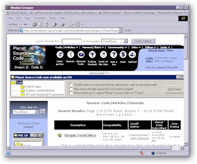



## Window Grouper

### Description

This Window Grouper demo project was made just to test a concept. What it does be default is, while running, monitor for any Internet Explorer windows that get opened. When one is detected it will group it into the window grouper interface and give the window a tab. The effect is that you will have only one window open (the Window Grouper) and that one window will contain a tabbed interface to all your open browsers. By right clicking on a tab you can bring up the Get Windows option to list all other running applications and pick one to also group into the interface (ie, Word, Excel...what ever). This code is far from perfect and was only made to test a concept to see if I wanted to go further. I thought I would share this to teach others how this can be done (this way but of course there are always better ways). Some code in here (mainly the EnumWindows stuff was given to me from another developer who got it from a online database which the person there said they got it from PSC so looks like this part of the code really gets around.
 
### More Info
 

             |
---                |---
**Submitted On**   |2003-03-04 10:34:18
**By**             |[Chloe](https://github.com/Planet-Source-Code/PSCIndex/blob/master/ByAuthor/chloe.md)
**Level**          |Intermediate
**User Rating**    |4.9 (89 globes from 18 users)
**Compatibility**  |VB 6\.0
**Category**       |[Complete Applications](https://github.com/Planet-Source-Code/PSCIndex/blob/master/ByCategory/complete-applications__1-27.md)
**World**          |[Visual Basic](https://github.com/Planet-Source-Code/PSCIndex/blob/master/ByWorld/visual-basic.md)
**Archive File**   |[Window\_Gro155423342003\.zip](https://github.com/Planet-Source-Code/chloe-window-grouper__1-43733/archive/master.zip)

